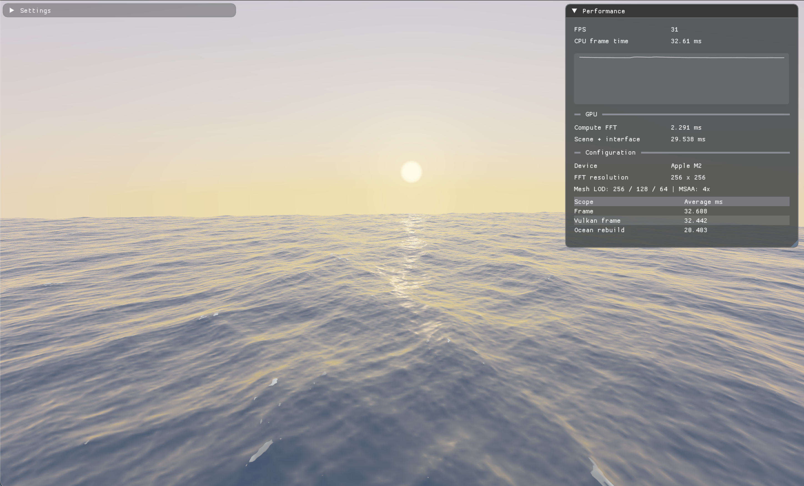

# Vulkan Water Renderer

A real-time Vulkan ocean renderer built around Tessendorf's spectral wave
model. The CPU builds deterministic spectral seeds when settings change.
Vulkan compute then evolves nine complex fields, runs the 2D inverse FFT, and
writes displacement and surface-differential images directly on the GPU each
frame.

## Features

- Tessendorf/Phillips wind spectrum with quantized deep-water dispersion
- Horizontal choppiness, vertical displacement, slopes, and displacement
  derivatives generated through 2D inverse FFTs
- Radix-2 Vulkan compute FFT with GPU-resident ping-pong buffers
- Camera-centered, endlessly repositioned tiled water mesh
- Preetham/Perez analytic daylight model for sky and reflections
- Configurable day/night cycle with sun, moon, stars, twilight, and exposure
- Fresnel reflection/transmission, sun glints, RGB absorption, scattering, and
  backscattering
- Jacobian-based breaking-wave foam with procedural breakup controls
- Procedural underwater terrain, normals, lighting, and attenuation
- Three distance-selected mesh LODs and MSAA where supported
- Dear ImGui settings and performance windows with CPU/GPU timing

## Repository Guide

- [Architecture overview](docs/ARCHITECTURE.md)
- [Technical decisions and known limitations](docs/TECHNICAL_NOTES.md)
- [Third-party notices](THIRD_PARTY_NOTICES.md)
- [Project license](LICENSE)

## Screenshots




## Performance Snapshot

Measured with `./build-release/bin/WaterRenderer --benchmark` on Apple M2 at
1600x900, tile radius 3, 4x MSAA, Release build. GPU times come from Vulkan
timestamp queries.

| Device | Build | Window | FFT | Tile Radius | Avg FPS | CPU Frame | GPU FFT | GPU Render |
|---|---:|---:|---:|---:|---:|---:|---:|---:|
| Apple M2 | Release | 1600x900 | 128x128 | 3 | 59.7 | 16.74 ms | 0.446 ms | 15.545 ms |
| Apple M2 | Release | 1600x900 | 256x256 | 3 | 37.3 | 26.84 ms | 2.051 ms | 24.286 ms |
| Apple M2 | Release | 1600x900 | 512x512 | 3 | 17.1 | 58.41 ms | 10.381 ms | 47.498 ms |

## Requirements

- C++20 compiler
- CMake 3.24 or newer
- Vulkan SDK with `glslc`
- Vulkan 1.2-capable driver or portability layer
- Device support for compute shaders and `rgba32f` storage images
- Ninja is recommended for the documented command line

CMake can fetch GLFW, GLM, spdlog, and Dear ImGui when they are not already
available. Set `-DWATER_FETCH_DEPENDENCIES=OFF` to require preinstalled
dependencies instead.

## Build and Run

From the repository root:

```sh
cmake -S . -B build -G Ninja -DCMAKE_BUILD_TYPE=Release
cmake --build build --target WaterRenderer
./build/bin/WaterRenderer
```

To build without Ninja, omit `-G Ninja` and use the generator selected by
CMake:

```sh
cmake -S . -B build -DCMAKE_BUILD_TYPE=Release
cmake --build build --config Release --target WaterRenderer
./build/bin/WaterRenderer
```

Run the local benchmark table:

```sh
./build/bin/WaterRenderer --benchmark
```

Useful configure options:

```sh
cmake -S . -B build -G Ninja -DCMAKE_BUILD_TYPE=Debug -DWATER_ENABLE_VALIDATION=ON
cmake -S . -B build -G Ninja -DCMAKE_BUILD_TYPE=Release -DWATER_FETCH_DEPENDENCIES=OFF
```

Shader sources in `shaders/` are compiled during the build into
`build/shaders/*.spv`. The executable expects those compiled shaders through
the `WATER_SHADER_DIR` path generated by CMake, so run the built executable
from the matching build tree.

## Controls

- Hold right mouse button and move the mouse: look
- `W`, `A`, `S`, `D`: horizontal movement
- `Space` / `C`: up / down
- `Shift` / `Control`: fast / slow movement

Spectrum parameters that alter the basis rebuild and upload the compact seed
buffer. Choppiness and height scale update immediately without rebuilding.

## Rendering Model

The displacement texture stores `(Dx, height, Dz, Jacobian)`. The normal
texture stores `(slopeX, slopeZ, dDx/dx, dDz/dz)`. The compute finalization
pass writes both images; the vertex shader samples them to construct the
displaced position and choppy-wave normal.

For each water fragment, the shader evaluates:

```text
L = Fr * (Lsun + Lsky) + (1 - Fr) * Lunderwater
```

The underwater camera ray intersects a noisy terrain surface. Bottom radiance
is attenuated with wavelength-dependent extinction, while volume
backscattering accumulates along the ray. Camera-centered periodic tiles and
continuous repositioning allow travel without a world boundary.

The optical and spectral implementation follows the sources cited by the
[reference project](https://github.com/kentril0/WaterSurfaceRendering), notably
Tessendorf, Premoze/Ashikhmin, Baboud/Decoret, and Preetham et al.
